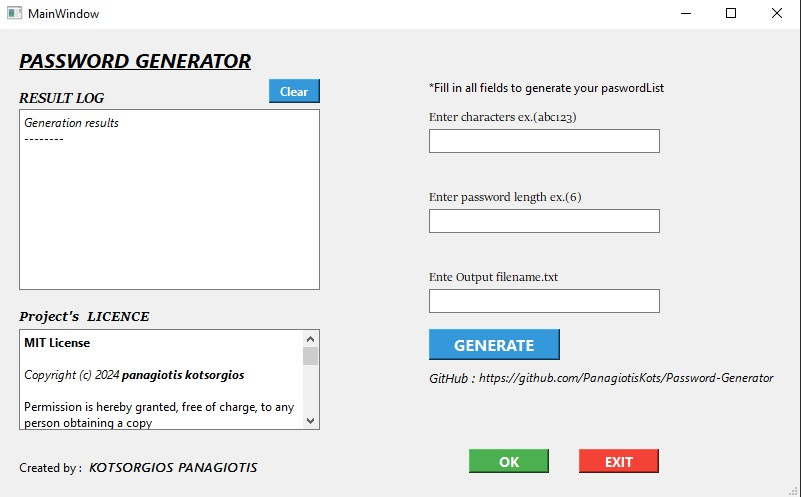

    
# Qt Password Generator 🛠️

## Overview

The **Qt Password Generator** is a desktop application developed with the Qt framework. It allows users to generate passwords based on a specified character set and length, with an intuitive graphical user interface (GUI) for easy interaction.

## Features 🌟

- **Generate Passwords**: Create secure passwords using a custom character set and length.
- **Save Passwords**: Save the generated passwords to a file.
- **Interactive GUI**: User-friendly interface built with Qt.
- **Error Handling**: Provides feedback if inputs are missing or invalid.

## Requirements ⚙️

| Component        | Description                                         |
|------------------|-----------------------------------------------------|
| **Qt**           | Qt 5.15 or later. Download from [Qt's official website](https://www.qt.io/download). |
| **C++ Compiler** | Compatible C++ compiler (e.g., GCC, Clang, MSVC).  |
| **C++ Standard** | C++11 or later is required for modern C++ features. |
| **CMake**        | CMake 3.10 or later for managing the build process. |
| **Git**          | Git for version control (optional but recommended for collaboration). |

**Note:** Ensure that all dependencies are correctly installed and configured to successfully build and run the application.

Installation 🏗️

    Clone the Repository:

    bash

git clone https://github.com/yourusername/qt-password-generator.git
cd qt-password-generator

Build the Project:

    Open the project in Qt Creator.
    Configure the project by following the prompts.
    Build the project using the build button or via the command line:

    bash

qmake
make

## Usage 📋

- **Launch the Application:**
  - Open the compiled executable from the build directory or run it from Qt Creator.

- **Generate Passwords:**
  - Enter the desired character set in the first input field.
  - Specify the length of passwords in the second input field.
  - Click the **"Generate"** button to generate passwords.

- **Save Passwords:**
  - Enter the filename in the third input field where passwords will be saved.
  - Click the **"Save"** button to save the generated passwords to the specified file.

- **Clear Text:**
  - Click the **"Clear"** button to clear the results displayed in the text area.

## Image Gallery 🖼️

Explore the application interface and features through the images below:

| Screenshot                                            | Description                                         |
|-------------------------------------------------------|-----------------------------------------------------|
|    | Main window showing the input fields and buttons. |
|  | Interface after generating passwords. |
|  | Save file dialog for saving generated passwords. |

**Click on the images to view them in full size.**

Contributing 🤝

    Fork the Repository: Create your own fork of this repository on GitHub.
    Create a Branch: Create a new branch for your changes.

    bash

git checkout -b feature/your-feature

Make Changes: Implement your changes or add features.
Commit Changes:

bash

git add .
git commit -m "Add a descriptive commit message"

Push to GitHub:

bash

git push origin feature/your-feature

Create a Pull Request: Open a pull request from your branch to the main repository.

License 📜

This project is licensed under the MIT License - see the LICENSE file for details.
Acknowledgments 🎉

    Qt for the GUI framework.
    Any other libraries or tools used in this project.

## Technologies & Tools 🚀

The Qt Password Generator project utilizes a variety of technologies and tools. Below are some of the key components with their respective icons:

| Technology       | Icon                                                 | Technology       | Icon                                                 | Technology       | Icon                                                 |
|------------------|------------------------------------------------------|------------------|------------------------------------------------------|------------------|------------------------------------------------------|
| **Qt**           |              | **C++**          |          | **CMake**        |        |
| **Git**          |            | **QWidget**      |         | **QTimer**       |         |
| **QMessageBox**  |      | **QTextEdit**    |       | **QLineEdit**    |       |
| **QEventLoop**   |       | **QPushButton**  |     | **QFileDialog**  |     |

**Icons are sourced from [Skillicons](https://skillicons.dev/).**

## Contact Information 📫

For any inquiries, contributions, or feedback, feel free to reach out to the project creators:

|  | **Name**        | **Role**                   | **Email**                | **GitHub**                                      | **LinkedIn**                                   | **Twitter**                                   | **Facebook**                                  |
|----------------------------------------------|-----------------|----------------------------|--------------------------|------------------------------------------------|-----------------------------------------------|-----------------------------------------------|-----------------------------------------------|
|  | **[Your Name]** | Project Lead / Developer   | your.email@example.com   |      |  |  |  |
|  | **[Contributor Name]** | Contributor / Developer    | contributor.email@example.com |  |  |  |  |

### General Inquiries

For general questions or support, please email: [support@example.com](mailto:support@example.com)

### Contribution

If you would like to contribute to the project, please check out our [Contribution Guidelines](CONTRIBUTING.md) and feel free to open an issue or pull request.

---

**Note:** The contact information provided is for project-related inquiries only. For personal messages, please use the individual contact details listed above.

